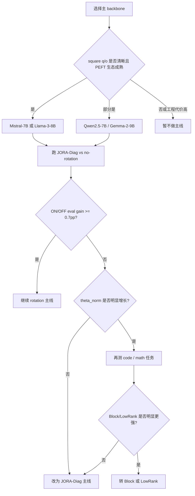
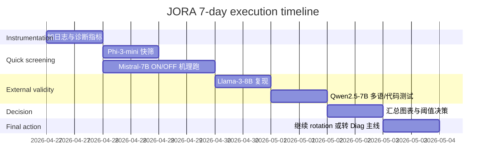

# JORA 底模与下游数据集选择报告

## Executive summary

这份报告的结论先给清楚。

第一，**如果你的目标是在 7 天内判断 JORA 值不值得继续押注 rotation，首选底模不是“最强模型”，而是“最能把 rotation 的信号暴露出来的模型”**。按这个标准，当前最优顺序是：**Mistral-7B → Llama-3-8B → Qwen2.5-7B → Phi-3-mini-4k → Gemma-2-9B → Flan-T5-XL**。其中，**Mistral-7B** 最适合作为主战场，因为它是 decoder-only、attention 的 `q_proj/o_proj` 是 square、社区 PEFT 基线成熟、你仓库里也已经围绕它做过主线实验与配置；**Llama-3-8B** 最适合作为“第二 backbone 验证”；**Qwen2.5-7B** 最适合检验 JORA 在多语/数学/代码任务上的外部有效性；**Phi-3-mini-4k** 最适合做快速机理筛查。citeturn1search0turn1search2turn1search5turn1search4turn2search0turn3search5

第二，**从第一性原理看，JORA 最吃底模的不是参数总量，而是“可旋转的 square attention 子空间有多干净”**。你仓库当前实现里，`SelectiveDiagCore` 明确要求 square target layer；`paper_path` 走的是 selective-diag + frozen support；`diag_path` 走的是 rotation + full DiagCore；rotation 的 pair selection 又依赖 EMA 统计和 optimizer-step 级更新。这意味着：**最适合 JORA 的不是所有 Transformer，而是“attention 结构清楚、q/o 可单独 target、PEFT 注入接口稳定、bf16/QLoRA 训练路径成熟”的模型族**。这也是为什么我会把 **decoder-only attention-only 设定** 放在 seq2seq、encoder-only、VLM 之前。fileciteturn6file0L1-L1 fileciteturn7file0L1-L1 fileciteturn8file0L1-L1 fileciteturn10file0L1-L1 fileciteturn11file0L1-L1 fileciteturn12file0L1-L1

第三，**最适合放大 rotation 优势的数据集类型，不是纯 instruction-following，而是“需要跨维度重排、但不要求大规模新知识写入”的任务**。具体说：  
- **知识型多选**（MMLU）和 **科学推理多选**（ARC-C）更容易测试“basis re-alignment 是否改善 readout”；  
- **数学推理**（GSM8K）对长期 credit assignment 更敏感，rotation 若有用，往往不会在 1 epoch 内立刻体现在 train loss，而更可能先体现在 `theta_grad_norm / theta_norm` 的可学习性和后续 eval；  
- **代码**（HumanEval/MBPP）比普通 SFT 更容易暴露 DiagCore 的表达瓶颈，因此很适合区分你该坚持 DiagCore 还是转向 Block/LowRankCore；  
- **纯 Alpaca-cleaned 一类通用 SFT** 更适合做“主表挂载场景”，不适合单独作为 rotation 价值判断的唯一证据。citeturn6search3turn6search8turn6search1turn5search0turn7search0turn7search2

第四，**如果你现在只想知道“rotation 还值不值得继续烧卡”**，我给一个很直接的标准：  
- 在 **两个 backbone × 两类任务** 上，若 `rotation ON` 相比 `OFF` 的短程 eval 提升 **始终 <0.5pp**，同时 `theta_norm` 基本不动、`theta_grad_norm` 长期显著小于 `diag_grad_norm`，那就不要再把 rotation 当主 claim，**立刻转为 JORA-Diag 主线**；  
- 若在 **知识/数学/代码三类任务中至少两类**，`ON` 比 `OFF` 稳定高 **0.7–1.0pp**，而且这种增益能跨 Mistral-7B 和 Llama-3-8B 或 Qwen2.5-7B 复现，再继续做 rotation 论文主张才合理。这个判断门槛不是理论推导，而是结合你仓库实现形态、当前 repo 中 reviewer 反馈对“no-rotation control / second backbone / orthogonal baseline”的持续强调，以及 PEFT 审稿脉络给出的务实阈值。fileciteturn9file11L1-L1 fileciteturn9file17L1-L1

## JORA 实现约束与它对底模选择的直接影响

我先把 **Lucas-Jin-Qh/JORA** 仓库里最影响“底模该怎么选”的实现点抽出来，因为这部分比任何高层叙事都更决定实验成败。仓库审计我优先走了已启用的 GitHub connector，并读取了 `src/peft/tuners/jora/{layer,config,core,rotation,selection,callbacks}.py` 与 `train_with_config.py`。fileciteturn6file0L1-L1 fileciteturn7file0L1-L1 fileciteturn8file0L1-L1 fileciteturn9file0L1-L1 fileciteturn10file0L1-L1 fileciteturn11file0L1-L1 fileciteturn12file0L1-L1

**最关键的实现约束只有五条。**

其一，`SelectiveDiagCore` 纸面路径当前**要求 square target layer**。`layer.py` 在 adapter state 初始化时直接检查：如果 `core == "selective_diag"` 且 `m != n`，就抛异常；`core.py` 里 `build_core("selective_diag")` 也把 support size 固定成 `2k`，而不是随层宽自由增长。这意味着：**你如果想把 paper-path 当主线，就天然更偏向 q_proj / o_proj 这类 square projection，而不适合先上 GQA/MQA 的 k_proj / v_proj，更不适合先上大多数矩形 MLP 投影。** 这条约束本身就把最优 backbone 缩到了“attention-only 可干净 target 的 decoder-only LLM”。fileciteturn6file0L1-L1 fileciteturn8file0L1-L1

其二，`JoraConfig` 事实上已经把路线分成两条：`paper_path()` 和 `diag_path()`。前者默认 `core="selective_diag"`、`magnitude="none"`、`zero_init_core=True`、`pairs_freeze_after_warmup=True`、`theta_init_std=0.0`；后者默认 `core="diag"`、`selection="none"`、`magnitude="none"`、`S_L=S_R=32`、`zero_init_core=True`、`lr_theta=0.01`、`lr_core=0.05`。这非常重要，因为它说明**repo 当前实际上已经把“极限稀疏 selective story”和“可投稿主线的 JORA-Diag story”分开了**。因此，底模选择也应该跟着分：  
- **paper-path** 选“最干净的 square decoder backbone”；  
- **diag-path** 可以选更强、更通用、甚至带 GQA 的 backbone，但仍然优先 q/o scope。fileciteturn7file0L1-L1

其三，rotation 路径的工程成本并不轻。`rotation.py` 里的 `apply_rotations_torch()` 会做 clone、`index_select`、`index_copy_`；虽然支持 `triton` / `auto` 路径，但 `auto` 又会在 CPU 或 pair 越界风险时回退到 torch 实现。再叠加 `selection.py` 里 top-k pair selection、`layer.py` 里的 activation EMA 与 gradient EMA、以及 `callbacks.py` 中 **按 optimizer-step 而非 micro-batch** 更新 selection 的机制，rotation 的 wall-clock overhead 是结构性存在的，不是偶然的。**这会直接推高“宽层 + 多层 + 长序列 + 高频更新”的训练成本。** 所以如果目标是先判定机理，而不是冲极限分数，backbone 不宜一上来选太宽太深的 >20B 模型。fileciteturn9file0L1-L1 fileciteturn10file0L1-L1 fileciteturn11file0L1-L1

其四，repo 在训练入口已经明显偏向 **bf16 + DDP + PEFT 标准栈**。`train_with_config.py` 对 JORA 默认把 `torch_dtype` 自动切到 `bfloat16`，显式打开 `ddp_find_unused_parameters=True` 和较长的 `ddp_timeout`，同时暴露了 4-bit 量化参数和多 GPU 启动方式。换句话说，**最适合 JORA 的底模之一，不仅要理论上适配，还要社区里已有稳定的 bf16 / QLoRA / torchrun / accelerate 训练路径**。这也是我把 Mistral-7B、Llama-3-8B、Qwen2.5-7B 排在前面的现实原因。fileciteturn12file0L1-L1

其五，repo 当前 reviewer 痛点一直围绕三件事打转：**no-rotation control、第二 backbone、orthogonal baseline**。这说明你现在真正需要的不是“找最 fancy 的模型”，而是找**能最快把这三个 gatekeeping 项补齐**的模型组合。就这个目标而言，**Mistral-7B + Llama-3-8B/Qwen2.5-7B** 的价值远大于更大的单一 backbone。fileciteturn9file11L1-L1 fileciteturn9file17L1-L1

## 从第一性原理看，哪些底模属性最关键

JORA 不是一般的 additive PEFT。它本质上是在 frozen basis 上做 **rotation + basis-aligned scaling / correction**。所以你挑底模时，不能只看“哪个模型 benchmark 高”。要看的是：**这个 backbone 的内部几何结构，是否适合用 rotation 来重新对齐，而不是用 LoRA 那种低秩新方向去补。**

### square attention 子空间

这是第一优先级。因为 rotation 本质上是同维空间中的基变换，最适合在 `d × d` 的 projection 上发挥，而不适合一开始就处理明显的矩形映射。Mistral-7B 与 Llama-3-8B 都是 decoder-only，并使用 GQA；这意味着 q/o 仍是完整 hidden-size square projection，而 k/v 在 head grouping 下往往更不适合作为 paper-path 的首批 target。Qwen2.5-7B 与 Phi-3 也有 `num_key_value_heads < num_attention_heads` 的 GQA/MQA 风格配置，逻辑相同。T5/Flan-T5 虽然是 encoder-decoder，但 attention 的 Q/K/V/O 在 text2text 框架下通常更规整，因此很适合作为“结构机理对照组”，只是工程接入成本更高。citeturn10search0turn1search5turn8search1turn3search0turn3search5 fileciteturn6file0L1-L1 fileciteturn8file0L1-L1

### hidden size 与有效维度覆盖

对 `JORA-Diag` 来说，若只在 `q_proj/o_proj` 上做 adaptation，**每个 module 的 trainable 参数近似是 `d + S_L + S_R`**；若再开 OER，还要再加一个 output-dim 向量。于是 hidden size 越大，DiagCore 的绝对容量越大，也越容易学到“每维独立缩放 + 旋转后重排”的组合；但同时 rotation 成本也会上升。对 `SelectiveDiagCore` 来说，`build_core()` 把 support size 固定成 `2k`，于是 hidden size 从 3072 到 4096 再到更大时，**可学习容量并不会随 d 成比例增长，反而更容易出现“支持集太小、覆盖不了真正有用维度”的问题。** 这会让 selective 路线在更宽模型上更需要好的 warmup 与 pair allocation，而不是自动更强。fileciteturn7file0L1-L1 fileciteturn8file0L1-L1

### 架构类型

**decoder-only** 最适合现在的 JORA 主线。原因不是“它最流行”，而是：  
- repo 的 SFT/benchmark 路径本来就更贴近 decoder-only；  
- instruction tuning、math reasoning、code generation 这些 PEFT 主战场本来就更常用 decoder-only；  
- 你最需要的，是一个对照 LoRA / DoRA / BOFT / qGOFT 都成熟的生态。  
**encoder-decoder** 的优势在于 attention 结构更规整、cross-attention 可测，但工程上需要另外一套 seq2seq 训练与评估逻辑；  
**encoder-only** 则不适合你当前主线，因为它更偏分类/理解，不利于和 LoRA/DoRA 在当下最有审稿价值的 SFT/reasoning 赛道对齐。citeturn1search2turn3search5turn3search8

### norm / activation / pre-norm 结构

JORA 的 rotation preservation 假设，本质上更适合**pre-norm、hidden-state 尺度稳定**的骨干，因为 rotation 不改范数，DiagCore/DoRA/OER 才是主要尺度调节器。Mistral、Llama、Qwen、Phi、Gemma 这类现代 decoder 基本都在稳定的 norm 设计上收敛得很好，因此更适合测 “rotation 是否真的加分”；如果 backbone 本身 norm/activation 更激进、层间尺度漂移更大，那么 rotation 的增益更容易被 scale 学习吞掉。这个结论更多是结构推断，但它和 DoRA 的“拆 magnitude 与 direction”思想是相互呼应的：当尺度问题被单独建模时，方向/基底的操作才更容易显出价值。citeturn0search6turn0search1

### 量化与混合精度支持

你仓库已经显式为 JORA 走 bf16，并提供 4-bit 开关。对于 PEFT，**量化不是附加分，而是现实部署条件**。凡是量化路径不稳、或者在 PEFT 库里 target module 映射不成熟的模型，都会极大拖慢 rotation 方向的验证速度。Mistral、Qwen、Phi、Llama 生态在这方面明显更成熟；T5-family 也成熟，但你的 repo 主路径不是围绕它搭的。fileciteturn12file0L1-L1 citeturn1search0turn1search4turn2search0turn1search3

### tokenizer 与语言覆盖

如果你只做英文 Alpaca + MMLU，那么 tokenizer 不是第一矛盾；但如果你想让 JORA 的故事更坚固，**多语或中英混合 validation 非常有价值**。这时 Qwen2.5 的长上下文、多语言、数学/代码增强就会更有吸引力；Llama-3 官方主要面向英文，但官方也明确说明可以在其他语言上继续微调。对于“rotation 是否在不同语言子空间中更有利”这个问题，Qwen2.5 比 Mistral/Llama-2 更适合作第二主力。citeturn1search4turn1search5turn6search2

### mergeability 与推理开销

LoRA 的一个基本优势，是 merge 后无额外推理开销。JORA 若要和 LoRA/DoRA/BOFT/qGOFT 正面打，**mergeability 不能只是功能存在，而要是“主路径可解释、误差边界可接受、工程上可用”**。你仓库已经实现 merge/unmerge，并且对 selective-diag 路径用 basis probing 近似/构建 operator，这很好；但这也进一步说明，**首选底模应该是社区里标准线性层、无奇怪自定义 kernel 的主流 backbone**，否则 merge 测试和数值一致性会很痛苦。fileciteturn6file0L1-L1

## 候选底模与最合适任务类型

下面这张表给的是**实际做研究的排序**，不是“模型榜单排序”。分数是我的综合判断，不是外部 benchmark 分数。

| 候选底模 | 架构与规模 | 为什么适合或不适合 JORA | 最适合先做的任务/数据集 | 兼容性 | 预期 JORA 效果 | 训练成本 | 实现难度 | 社区可复现性 |
|---|---|---|---|---:|---:|---:|---:|---:|
| **Mistral-7B-v0.1 / Instruct** | decoder-only，约 7B，GQA，滑窗注意力，bf16 生态成熟 citeturn1search0turn1search2turn10search0 | **最优主战场**。q/o 是 square，repo 与现有实验已经对齐它；既足够强，又不至于调试成本爆炸。非常适合做 JORA-Diag vs LoRA/DoRA/BOFT/qGOFT 主表。 | Alpaca-cleaned SFT → MMLU / ARC-C / GSM8K；再加一组 MetaMathQA/GSM8K 强化 reasoning。citeturn5search0turn6search3turn6search8turn6search1 | 9 | 9 | 7 | 8 | 9 |
| **Llama-3-8B** | decoder-only，8B，GQA，官方英文主线，32 层 8K context citeturn1search5turn9search0 | **最佳第二 backbone**。和 Mistral 同级但不是同一家族，最适合回答“JORA 是否只是 Mistral artifact”。 | Alpaca-cleaned SFT → MMLU / ARC-C / GSM8K；不需要第一周就把所有 ablation 全跑。citeturn5search0turn6search3turn6search8turn6search1 | 8 | 8 | 7 | 7 | 9 |
| **Qwen2.5-7B-Instruct** | decoder-only，7B，hidden size 3584，28 层，4 KV heads，擅长数学/代码/长文本/结构化输出 citeturn1search4turn8search1 | **最适合测试外部有效性**。如果 JORA 真的是“basis re-alignment”而不是 Mistral recipe trick，它应该在 Qwen2.5 上至少保留方向性增益。对多语、代码、数学尤其重要。 | Alpaca-cleaned → MMLU/CMMLU；代码用 HumanEval/MBPP；数学用 GSM8K。citeturn5search0turn6search3turn6search2turn6search1turn7search0turn7search2 | 8 | 8 | 6 | 7 | 8 |
| **Phi-3-mini-4k-instruct** | decoder-only，3.8B，轻量，强调 reasoning，hidden size 3072，32 层 citeturn2search0turn3search0 | **最快的机理筛查模型**。如果你要看 rotation 是否“活着”，它是很好的快筛底模；但不适合作为最终主表 backbone，因为审稿说服力弱。 | Alpaca 子集 / GSM8K 子集 / 500–1500 step quick run；重点看 `theta_grad_norm`、ON/OFF 差值，而不是最终 SOTA。citeturn5search0turn6search1 | 9 | 6 | 9 | 9 | 8 |
| **Gemma-2-9B** | decoder-only，9B，42 层，hidden size 3584，8 KV heads，滑窗注意力 citeturn3search6turn11search1 | **中高优先级 robustness check**。层数更多，若 rotation 真有长期 credit assignment 价值，它可能更容易在更深模型里体现；但工程和训练都更重。 | Alpaca-cleaned / GSM8K；更适合二阶段 robustness，而不是首周。citeturn5search0turn6search1 | 7 | 7 | 5 | 6 | 7 |
| **Llama-2-7B** | decoder-only，7B，32 层，传统 MHA，hidden size 4096 citeturn1search3turn9search1 | **历史兼容 baseline 很好，但不是最优研究主线**。优点是 PEFT 基线非常成熟，缺点是新鲜度和性能生态不如 Mistral/Llama-3/Qwen2.5。 | 作为附加 backbone 验证最合适；如果你已有大量 Llama2 config，可快速补表。 | 8 | 7 | 7 | 7 | 9 |
| **Flan-T5-XL** | encoder-decoder，约 3B，text-to-text，多语广覆盖 citeturn2search1turn3search8 | **不是主线，但很好的结构对照组**。如果你要写“JORA 不只在 decoder-only 上成立”的 appendix，T5-family 很合适；但你当前 repo 训练主路径不是为它搭的。 | 小型 seq2seq 分类/生成任务；用途主要是机理对照，不是把它做成主表。 | 5 | 6 | 6 | 4 | 8 |

### 我给你的明确推荐

如果你现在要排优先级，我会这样定：

**主线底模：Mistral-7B。**  
它最符合你当前 repo 的实现重心，也最容易对齐 LoRA / DoRA / BOFT / qGOFT 的比较。Mistral-7B 官方卡明确采用 GQA 与 sliding-window attention，HF 生态成熟；更重要的是，repo 内部的 proposal、sweep、benchmark 叙事也一直以 Mistral-7B 作为主舞台。citeturn1search0turn1search2turn10search0 fileciteturn9file11L1-L1

**第二底模：Llama-3-8B。**  
它的作用不是冲分，而是给你一个 reviewer 很难反驳的最小外部有效性证明：**同样是现代 decoder-only 7–8B 级模型，JORA 在另一家族上是否仍然成立。** 如果你只能补一个第二 backbone，就补它。citeturn1search5turn9search0

**第三底模：Qwen2.5-7B。**  
它最值钱的地方在于：一旦 JORA 在它上面也工作，你就不仅能讲 instruction SFT，还能讲**多语、数学、代码**。这会明显抬高论文外部有效性。反过来，如果只在 Mistral 好，在 Qwen2.5 上不行，那你也能更清楚地定位：JORA 的 inductive bias 更像是“英文通用 SFT 上的 rotation-basis trick”，而不是一般性 PEFT 机制。citeturn1search4turn8search1turn6search2turn7search0turn7search2

**快筛底模：Phi-3-mini-4k。**  
它应该被当作工具，不是目标。你在它上面跑 rotation/no-rotation、diag/block/lowrank 的短程机理实验，会比在 7B 模型上便宜很多，而且足以提前暴露“theta 根本不学”“S 太小无效”“BlockCore 才真正需要”的问题。citeturn2search0turn3search0

## 下游任务与数据集类型的匹配原则

### instruction SFT 只适合当挂载场景，不适合单独裁决 rotation

像 **yahma/alpaca-cleaned** 这种 51.8K 英文 instruction-tuning 数据，非常适合做主表训练语料，因为它便于与现有 PEFT 文献和你的 repo 现状对齐，而且训练开销可控。它能告诉你 JORA 有没有成为一个“正常可训练的 adapter”。但它**不适合单独拿来裁决 rotation 是否重要**，因为这类数据目标异质性太强，训练 loss 很容易主要由 general instruction formatting、response style 与基础 alignment 吸收，而不是被“basis rotation”显著控制。citeturn5search0

### 知识型多选最适合测 basis re-alignment

**MMLU** 覆盖 57 个学科任务，最适合作为“广谱 readout 改善”指标；**ARC-Challenge** 是更硬的科学推理多选集，能测试 adaptation 是否只是套模板，还是确实改善了知识与推理读出。你若想证明 rotation 不是虚的，这两类 benchmark 必须在。因为在这些任务上，**低秩新增方向** 和 **预训练 basis 的重新对齐** 往往有不同表现。若 JORA 的核心假设成立，它至少应该在这类任务上展示出不弱于 LoRA/DoRA 的表现。citeturn6search3turn6search8

### 数学推理最适合测长期 credit assignment

**GSM8K** 的题目通常需要 2–8 步推理。对于这类任务，rotation 的作用更可能体现在**更晚阶段的 eval 改善**，而不是一开局就反映在 train loss 上。因此，若你观察到 1 epoch 里 ON/OFF train loss 差异很小，这并不自动意味着 rotation 没用；更合理的做法是同步看 `theta_grad_norm`、`theta_norm`、早中期 eval 曲线，以及更长 steps 后的差距。换句话说，**GSM8K 是 rotation 的“延迟显效”任务**。citeturn6search1

### 代码任务最适合区分 DiagCore 与更强 core

如果你只用 Alpaca + MMLU/ARC/GSM8K，很可能很难判断是“rotation 没用”，还是“DiagCore 容量不够”。**HumanEval** 和 **MBPP** 非常适合做这个区分。因为代码生成比一般 instruction SFT 更依赖精细的跨维度组合与局部算法结构；如果在代码任务上，`JORA-Diag` 稳定落后于 LoRA/DoRA，而 `JORA-LowRankCore` 或 `BlockCore` 明显追上来，就非常强地暗示：**瓶颈主要在 core，不在 rotation 本身。** 反过来，如果 code 上 rotation 仍然不给增益，那你就更有理由把主线收缩到 DiagCore 的参数效率故事。citeturn7search0turn7search2

### 多语任务最适合检验“rotation 是否真在做 basis 对齐”

若你选 Qwen2.5-7B，建议加一个**CMMLU** 或同类中英多语 benchmark。原因很简单：如果 JORA 本质上是在对预训练表示做低成本基底重排，那么在多语任务上，它应该比“纯 style-only 的小 adapter”更容易表现出迁移价值。这个测试对你很重要，因为它可以明显区分“这个方法只是在英文 Alpaca 上配了个好 recipe”，还是“这个方法真的在利用 backbone 的通用表示几何”。citeturn1search4turn6search2

### VLM 微调现在不要做主线，只能做二阶段

你题目里提到 VLM。我给你的建议很直白：**第一周不要把 VLM 当主线。**  
原因不是它不重要，而是你当前 repo 的关键 gate 还在：rotation/no-rotation 机制、第二 backbone、orthogonal baseline。VLM 会同时引入视觉编码器、projector、cross-modal connector、数据清洗与评估协议问题，很容易把 rotation 信号淹没。更现实的路线是：**先在纯文本 backbone 上把 rotation 的存在性判清，再把 JORA 接到 VLM 的 language tower q/o scope 或 square projector 上。** 这一条是策略判断，不是说 VLM 不适合 JORA，而是说**现在投入产出比太差**。DoRA 论文确实展示了在 LLaVA / VL-BART 等视觉语言场景上的增益，但那是建立在它已经先把“magnitude vs direction”这件事讲清楚之后。JORA 还没到那一步。citeturn0search6turn0search1

## 小规模快速验证实验矩阵

下面这张表不是“最终论文矩阵”，而是**你下周最该跑的判别矩阵**。目标只有一个：**尽快判定 rotation 值不值得继续烧卡。**

| 优先级 | Backbone × 任务 | 训练配置 | 参数预算 | 评估集 | 关键诊断指标 | 预期资源 |
|---|---|---|---|---|---|---|
| P0 | **Mistral-7B × Alpaca-cleaned SFT** | `q_proj,o_proj`；JORA-Diag vs no-rotation；1k–2k steps；bf16；bsz 8/dev，grad acc 2 | JORA-Diag 约 266K；与 no-rotation 参数匹配 | MMLU 子集 + ARC-C 子集 + GSM8K 子集 | `train_loss`、`eval_acc`、`theta_norm`、`theta_grad_norm`、`diag_norm`、wall-clock | 8×A100-80GB 上约 8–12 GPUh；4×A100-40GB 上约 14–20 GPUh |
| P0 | **Mistral-7B × GSM8K/MetaMathQA 子集** | 同上，但训练更偏 reasoning；steps 1.5k–3k | 同上 | GSM8K main | `eval_acc` 随 step 变化；ON/OFF 差值是否后期拉开 | 10–16 GPUh |
| P0 | **Llama-3-8B × Alpaca-cleaned SFT** | 只跑 JORA-Diag / LoRA / no-rotation 三组；1k–2k steps | 近似与 Mistral 同级 | MMLU 子集 + ARC-C | “第二 backbone 是否复现方向性” | 10–16 GPUh |
| P1 | **Qwen2.5-7B × Alpaca-cleaned SFT** | `q_proj,o_proj`；1k–2k steps | JORA-Diag 约 204K | MMLU 子集 + CMMLU 子集 | 多语外推；`theta` 是否比 Mistral 更活跃 | 8–14 GPUh |
| P1 | **Qwen2.5-7B × 代码 SFT** | 小规模 code SFT；1k–2k steps | JORA-Diag / BlockCore / LowRankCore | HumanEval / MBPP | 判断 DiagCore 是否欠表达 | 10–18 GPUh |
| P1 | **Phi-3-mini × Alpaca/GSM8K 快筛** | 500–1500 steps；rotation/no-rotation/grid | 更小 | 轻量 held-out | 快速扫 `lr_theta × lr_core`、`S`、`k` | 3–6 GPUh |
| P2 | **Gemma-2-9B × Alpaca-cleaned** | 只跑最优配置复核 | JORA-Diag 主线 | MMLU + GSM8K | 更深模型中 rotation 是否更显效 | 16–24 GPUh |
| P2 | **Flan-T5-XL × 小型 seq2seq 任务** | appendix only；attention-only | 依 hidden size 而定 | 小型验证集 | 结构泛化，不作为主结论 | 6–10 GPUh |

### 我建议你重点记录的指标

不要只看 loss。你现在最需要的是**机理诊断信号**。

- `theta_norm / theta_init_norm`：看 rotation 参数到底有没有动。  
- `theta_grad_norm / diag_grad_norm`：看 rotation 的梯度信号是不是长期弱于 core。  
- `active_pairs` 或 support 统计：看 pair allocation 是否在一两百步后稳定。  
- `eval gain (ON - OFF)`：比 `train_loss` 更重要。  
- `wall-clock step time`：rotation 方向若增益极小但代价显著，就不值得做主 claim。  
- 若做 selective 路线，再加 `support Jaccard` 或 support stability。  

仓库里已经有这些诊断所需的大部分结构：EMA 统计、update interval、pair selection、optimizer-step callback，以及 rotation/no-rotation 的显式 ablation 开关。fileciteturn10file0L1-L1 fileciteturn11file0L1-L1 fileciteturn12file0L1-L1

## 决策规则、可视化建议与 7 天行动清单

### 决策规则

这部分我给硬阈值，不绕弯。

**继续投入 rotation 主线**，满足下面至少两条：  
1. 在 **Mistral-7B** 上，`rotation ON` 比 `OFF` 的短程 eval 提升 **≥0.7pp**，且不是单一 seed 噪声；  
2. 在 **第二 backbone**（Llama-3-8B 或 Qwen2.5-7B）上，方向一致，哪怕只到 **≥0.5pp**；  
3. `theta_norm` 在训练前 20–30% 预算内有明确增长，且 `theta_grad_norm / diag_grad_norm` 的中位数 **>0.2**；  
4. 增益主要出现在 **MMLU / ARC / GSM8K / code** 这类结构性任务，而不是只在 Alpaca train loss 上。  

**转为 JORA-Diag 主线、把 rotation 降为次要或附录**，满足下面任一条就可以：  
1. 在两个 backbone 上，`ON/OFF eval` 差异长期 **<0.5pp**；  
2. `theta_norm` 长期接近初始化，或 `theta_grad_norm` 持续被 core 压制到 **<0.1**；  
3. rotation 带来的 step-time 增幅显著，但最终收益不够覆盖工程成本；  
4. reviewer 需要的 no-rotation / second backbone / orthogonal baseline 已经能由 **JORA-Diag 效率故事** 更干净地承接。  

**转向 BlockCore**，当且仅当出现下面模式：  
- no-rotation 与 rotation 都有一定信号；  
- 但 DiagCore 在 code / math 上明显 underfit；  
- 并且 BlockCore 在同预算附近带来 **≥1pp** 的稳定增益。  

**转向 LowRankCore**，当且仅当出现下面模式：  
- 你发现真正有效的是“在 rotated basis 中学更密的子空间”，而不是 per-dim scaling；  
- 在代码或复杂 reasoning 上，LowRankCore 明显优于 DiagCore；  
- 你愿意承认主张会更靠近 “rotated LoRA” 而不是 “orthogonal-diag PEFT”。  

### 可视化建议

真正有用的图只需要三类。

第一类是**候选底模比较条形图**：横轴模型，纵轴综合评分或每 GPUh 的 eval gain。  
第二类是**ON/OFF 训练-评估折线图**：把 `train_loss`、`MMLU/ARC/GSM8K acc`、`theta_norm` 随 step 的曲线画出来。  
第三类是**Pareto 图**：横轴 trainable params（log scale），纵轴平均准确率，标出 LoRA / DoRA / JORA-Diag / JORA-Selective / Block / LowRank。  

下面两段 mermaid 代码可以直接放到你的内部文档或论文草稿里。

### 7 天内可执行的优先级行动清单

**Day 1：代码与日志补齐。**  
把 `theta_norm`、`theta_grad_norm`、`diag_norm`、`support_size/active_pairs`、step-time 全部打进训练日志。这个动作本身不需要大算力，但决定后面所有实验是不是可解释。预计 **6–8 小时**，1 人即可；GPU 只需做 smoke test。依据 repo 当前 callback / selection / rotation 结构，这些指标都能低成本接入。fileciteturn10file0L1-L1 fileciteturn11file0L1-L1

**Day 2：Phi-3-mini 快筛。**  
扫 `rotation ON/OFF`、`lr_theta × lr_core` 的小网格，顺手测 `DiagCore vs BlockCore` 的一个点。目标不是分数，是看 rotation 是否活着。预计 **6–10 GPUh**。若没有 A100，8×RTX4090 也完全能做。citeturn2search0turn3search0

**Day 3–4：Mistral-7B 主线机理实验。**  
至少跑：JORA-Diag、no-rotation、LoRA、DoRA。训练用 Alpaca-cleaned，评估看 MMLU/ARC-C/GSM8K 子集，必要时再延长到 full eval。预计 **40–80 GPUh**，看你 step 数和 eval 密度。若有 8×A100-80GB，这是最值得烧的卡。citeturn1search0turn1search2turn10search0turn5search0turn6search3turn6search8turn6search1

**Day 5：第二 backbone。**  
在 **Llama-3-8B** 上只复现最关键的三组：JORA-Diag、no-rotation、LoRA 或 DoRA。不要一口气做全 ablation。预计 **20–40 GPUh**。这一步的价值远大于继续在 Mistral 上细调第五个超参。citeturn1search5turn9search0

**Day 6：Qwen2.5-7B 外部有效性。**  
优先二选一：  
- 若你想保论文主线，跑多语小表：MMLU + CMMLU；  
- 若你想判 core，跑代码小表：HumanEval / MBPP。  
预计 **20–40 GPUh**。citeturn1search4turn8search1turn6search2turn7search0turn7search2

**Day 7：按阈值决策，不再纠结。**  
- 若 rotation 在至少两个 backbone / 两类任务上有效，继续做 orthogonal-family baseline 与 3-seed；  
- 若无效，马上转 **JORA-Diag 主线**，把论点收缩到“structured diagonal adaptation in rotated basis”或干脆“DiagCore efficiency”上。  
这一天主要是分析与写作，预计 **6–8 小时**。

## Open questions / limitations

这份报告有两个我主动保留的限制。

第一，**VLM 任务我只给了策略判断，没有继续扩展到完整的官方数据页与模型卡矩阵**。原因不是它不重要，而是对你当前阶段，VLM 不是首周最优先的验证方向。更直接地说：**先把文本旋转机理判清，再碰多模态。**

第二，**Gemma-2-9B 与 Llama-2/3 的部分精确配置数字，我优先用了公开可访问的 HF config 页面与镜像配置，而不是继续追更底层的原始权重清单**。这不影响本文的核心判断，因为我的排序依据主要是架构类型、q/o 是否 square、层宽/层深、生态成熟度和 repo 兼容性，而不是某个单独 config 字段的细枝末节。相反，当前真正的主风险仍然是：**rotation 的机理证据还不够硬**，不是“你还没找到那个神奇 backbone”。citeturn1search5turn9search1turn11search1

如果只留一句压轴判断，就是这句：

**JORA 当前最适合的主线底模是 Mistral-7B，最有价值的第二底模是 Llama-3-8B，最该补的外部有效性底模是 Qwen2.5-7B；最该优先跑的数据类型依次是知识多选、数学推理、代码，而不是继续在单一 Alpaca-cleaned 上磨 loss。** 先把 rotation/no-rotation 在这三件事上判清，你的路线就会一下子干净很多。